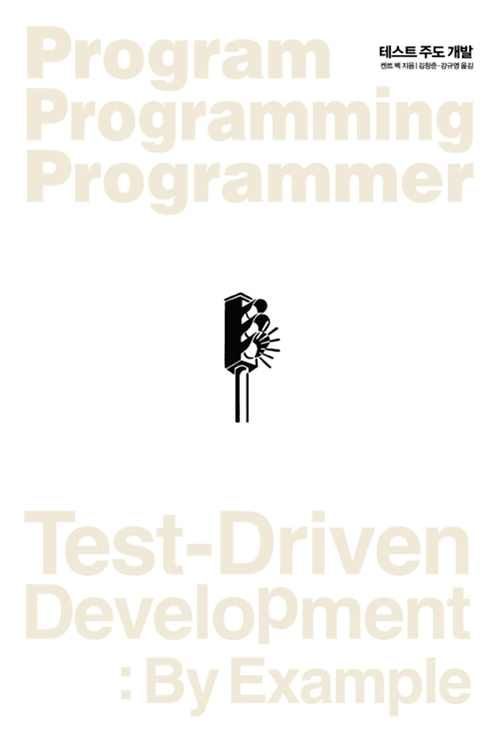
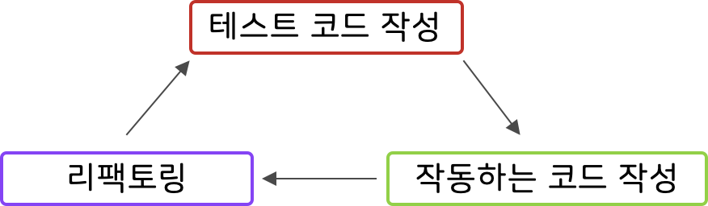

# Javascript TDD - 00장. TDD에 대하여

 

## 책에 들어가기에 앞서

기본적인 프로그래밍 언어에 대해 학습하고, 미션을 해결하거나 프로젝트를 위해 코드를 작성해보면 생각나는 대로 코드를 짜고 있는 나를 쉽게 발견할 수 있었다. 

이렇게 작성한 코드는 예상하지 못했던 예외 상황을 대처하기 어려웠고, 애초에 코드를 작성하면서 내가 뭘 개발하는지, 어디까지 개발한 것인지 집중력이 흐려질 때가 많았다. 코드 작성 시간이 길어지는 것은 기본이었다.

이런 비효율적인 개발이 싫어, 개발 방법에 대해 학습하고 싶어졌다. 그러다 우연히 TDD에 대해 접하게 되었고, 스터디를 하며 깊게 배워볼 기회가 생겼다.

TDD를 학습하기 위해 선택한 책은 "**테스트 주도 개발**"(켄트 백)이다. 앞으로 이 책에 대해서 학습하면서 배운 내용에 대해서 기록을 남기려고 한다.

 

## TDD에 대하여

본격적인 "**테스트 주도 개발**" 학습에 들어가기에 앞서 TDD에 대해 간단히 알아 보려 한다.

 

### TDD? Test Driven Development!

**테스트 주도 개발**(Test-driven development, **TDD**)은 매우 짧은 개발 사이클을 반복하는 소프트웨어 개발 프로세스 중 하나이다. 

우리가 아는 일반적인 개발 프로세스는 다음과 같다.

1. 프로그램을 설계한다. 
2. 설계를 바탕으로 코드를 작성한다.
3. 작성된 코드를 테스트 한다. 
4. 문제가 생긴다면 1번으로 돌아가, 설계를 수정하거나 다시 설계한다.

여기서 테스트는 주로 콘솔창에 찍어보거나 에디터의 디버깅 기능을 이용하여 이루어진다. 

보통 개발이 어느정도 완료된 이후에 테스트를 하기 때문에 문제가 발생되어 다시 수정하고 코드를 작성하려면 곤란했던 기억이 많다.

테스트 주도 개발은 기존의 개발 프로세스와 다르다. 짧게 나누어 다음 프로세스를 반복한다.

1. 코드를 검증하는 테스트 코드를 먼저 작성한다.
2. 작동하는 프로그램 코드를 작성한다.
3. 리팩토링(코드 수정)
4. 위의 과정을 빠르게 반복한다.

어느 개발 방법이 더 낫다라고는 할 수 없지만, 요즘 TDD가 트랜드인데는 다 이유가 있다고 생각한다. 직접 배워보면서 그 장점에 대해서 한 번 생각해보려 한다.

 

### TDD의 목표

TDD의 최종 목표는 **'잘 작동하는 깔끔한 코드'**이다. 일반적인 소프트웨어 개발에서 목표하는 '잘 작동하는 코드'인 점은 동일하다. 하지만 TDD는 여기에 유지보수의 용이성과 읽기 쉬운 코드 등의 '깔끔한 코드'를 '잘 작동하는 코드'와 동일하게 중요한 목표로 한다.

 

## TDD로 들어가서

TDD의 특성상 완성된 프로그램 코드를 보거나, 간단한 메뉴얼 정도로는 TDD를 익힐 수 없다. 그 과정을 하나하나 따라가며 직접 익혀야 한다.

 

### TDD 수련법

TDD를 잘 하기 위해서 역자는 다음과 같은 훈련 방법을 권장한다.

- 간단하고 쉬운 문제들을 TDD로 시도한다.
- 초록 막대 주기는 가능하면 짧게한다.
  - 여기서 초록 막대는 테스트를 통과한 작동하는 코드를 의미한다.
- 초록 막대 주기의 최대 시간을 정해 놓고 진행한다.
  - 시간 초과시 직전 초록 막대로 상태를 돌려(그 동안의 코드는 포기) 새로 시작한다.
- 진짜로 만들기 전까지만 가짜로 구현한다.
- 같은 문제를 여러번 풀어본다.
- 초기에는 리팩토링 툴을 사용하지 않는 것이 좋다.

 

---

>  ** Reference**
>
>  * [테스트 주도 개발, 켄트 벡](http://www.yes24.com/Product/Goods/12246033?scode=032&OzSrank=1)
>  * [TDD 실천법과 도구, 채수원](https://repo.yona.io/files/3920)