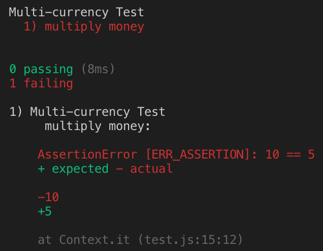
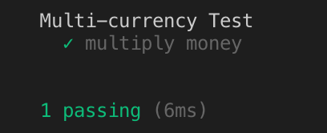

### 화폐 예제

**1부 소개**

 완전히 테스트에 의해 주도되는 전형적 모델 코드를 개발하는 것

- TDD의 리듬
  - 재빨리 테스트를 하나 추가한다
  - 모든 테스트를 실행하고 새로 추가한 것이 실패하는지 확인한다
  - 코드를 조금 바꾼다
  - 모든 테스트를 실행하고 전부 성공하는지 확인한다
  - 리팩토링을 통해 중복을 제거한다


- 이 과정에서 발견하게 되는 것
  - 각각의 테스트가 기능의 작은 증가분을 어떻게 커버하는지
  - 새 테스트를 돌아가게 하기 위해 얼마나 드러운 코드가 발생하는지
  - 얼마나 자주 테스트를 실행하는지
  - 얼마나 수 없이 작은 단계를 통해 리팩토링 되어가는지


## Chapter 1 다중 통화를 지원하는 Money 객체


| 종목 | 주   | 가격 | 합계  |
| ---- | ---- | ---- | ----- |
| IBM  | 1000 | 25   | 25000 |
| GE   | 400  | 100  | 40000 |
|      |      | 합계 | 65000 |

이러한 보고서를 다중 통화를 지원하는 보고서로 만들려면 통화 단위를 추가해야 한다.


| 종목     | 주   | 가격   | 합계     |
| -------- | ---- | ------ | -------- |
| IBM      | 1000 | 25USD  | 25000USD |
| Novartis | 400  | 150CHF | 60000CHF |
|          |      | 합계   | 65000USD |

여기서 목표는

- 통화가 다른 두 금액을 더해서 주어진 환율에 맞게 변한 금액을 결과로 얻어야 한다.
- 어떤 금액(주가)을 어떤 수(주식의 수)에 곱한 금액을 결과로 얻을 수 있어야 한다.


우선 둘중에 쉬워보이는 주가를 주식수만큼 곱한 금액을 결과로 하는 코드를 작성해본다.

```javascript

const testMultiplication = () => {
  let five = new Dollar(5);
  five.times(2);
  assertEquals(10, five.amount);
}
testMultiplication();

// result
// ReferenceError: Dollar is not defined

```

이 코드는

- Dollar class 없음
- constructor도 없음
- times(Number) method 없음
- amount property가 없음

없는 것 천지다. 

여기에서 테스트를 통화하기 위해(에러를 해결하기위해) 가장 단순한 작업들을 순차적으로 진행한다. 책의 순서와 달리 발생하는 에러들 순서대로 해결해본다.

1. Dollar class를 정의한다.

   `class Dollar{ }`

   result : `TypeError: five.times is not a function`

2. Dollar class의 times method를 선언한다.

   `times(multipiler){ }`

   result : `AssertionError [ERR_ASSERTION]: 10 == undefined`

**mocha를 사용하도록 한다!!!!**

```javascript
var assert = require('assert');

class Dollar{
  times(multipiler){

  }
}
describe('Multi-currency Test', () => {
  it('multiply money', () => {
    let five = new Dollar(5);
    five.times(2);
    assert.equal(10, five.amount);
  })
})
```

와 같이 코드를 급하게 바꿨다.

five.amount가 undefined 즉 dollar class에는 amount가 없다.

```javascript
constructor(amount){
    this.amount = amount
  }
```

constructor에 amount를 추가해준다.

다시 mocha!를 해주면



이렇게 예쁘게 틀렸다고 말해준다.

초록색으로 만들어주기 위해 그냥 amount를 10으로 만들어버린다



짠 통과했습니다.

이러한 과정을 지나오는데 이 주기는

1. 작은 테스트 하나를 추가한다.
2. 모든 테스트를 실행해서 테스트가 실패하는 것을 확인한다.
3. 조금 수정한다.
4. 모든 테스트를 실행해서 테스트가 성공하는 것을 확인한다.
5. 중복을 제거하기 위해 Refactoring을 한다.

**Refactoring이란?**  코드의 외적 행위는 그대로 유지하면서 내부 구조를 변경하는 작업을 뜻한다.


```javascript
times(multipiler){
    this.amount = 5*2
  }
```

times method 내부에 추가시킨다.

초록 막대를 유지시키며 코드를 바꾼다.

times는 multiplier를 인자로 받으므로 2를 multiplier로 교체하고,

5는 amount이므로 amount로 교체한다.


이제

\$5 + 10CHF = ​\$10 (환율이 2:1인 경우)
~~\$5 X 2 = \$10~~
make amount private
Dollar 부작용?
Money 반올림?

완료 표시를 해준다.


해낸 작업들

- 작업해야 할 테스트 목록을 만들었다.
- operation이 외부에서 어떻게 보이길 원하는지 말해주는 이야기를 코드로 표현
- mocha에 대해서는 짦막하게 소개하고 넘어갔다.
- Stub 구현을 통해 테스트를 컴파일했다.
- 꼼수를 써서 테스트를 통과시켰다.
- 돌아가는 코드에서 상수들을 변수로 변경하여 점진적으로 일반화하였다.
- 새로운 할일들을 한번에 처리하지 않고, 할일 목로에 추가하고 넘어갔다.


